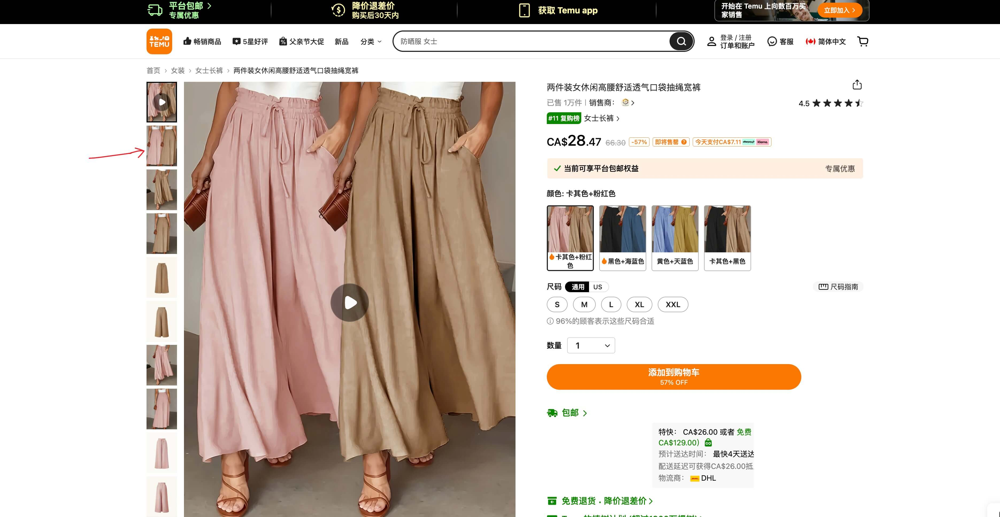
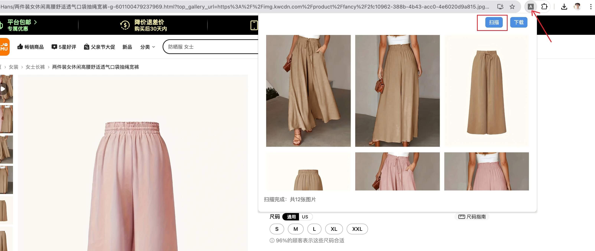

## 电商平台（amazon、shein、temu）的商品详情页图片 Chrome 下载插件

### 如何使用

#### 1. 进入电商平台的商品详情页，依次点击左侧小图片列表

#### 2. 点击右上角的插件图标，打开操作界面

#### 3. 点击“扫描”按钮，预览扫描到的图片列表

左下角提示“扫描完成，共 12 张图片”。

#### 4. 点击“下载按钮”，将所有图片下载到默认下载路径的"images/"文件夹。

左下角提示“下载完成，共 12 张图片”。
